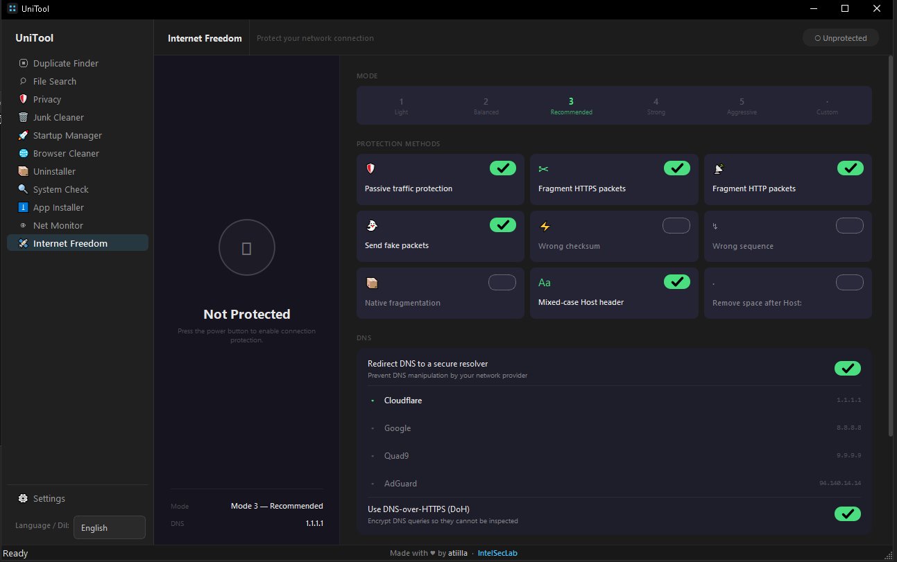

# UniTool

A fast, modern desktop utility suite for Windows, macOS, and Linux - built with Python and PyQt6.


---

## Features

### Duplicate Finder `[Win / Mac / Linux]`
- Scans one or more folders for duplicate files
- Content-hash deduplication (xxHash64, falls back to MD5)
- Size pre-filter + filename copy pattern detection
- Auto-select duplicates (keeps oldest copy)
- Moves selected files to the Recycle Bin / Trash via `send2trash`
- Session save/restore - resume last scan on next launch

### File Search `[Win / Mac / Linux]`
- Instant search powered by the OS's own file index — **no manual indexing needed**:
  - **Windows:** Windows Search Service (WSearch) via a persistent OLE-DB query process
  - **macOS:** Spotlight (`mdfind`)
  - **Linux:** `plocate` / `locate`
  - Fallback: built-in thread-pool scanner + SQLite FTS5 when no native index exists
- Location picker: search **All drives**, a specific drive (`C:`, `D:`), or **Browse…** any folder
- Scoped folder/drive searches stream results live as they're found (incremental, cancellable)
- Filter by file type (category presets or custom extensions like `.pdf, .md`), date range, file size
- Press **Enter** or **Search** to run; image preview panel with metadata

### Privacy Cleaner `[Win]`
- Clears shell history, USB traces, network fingerprints, credentials, cloud sync artifacts
- Clipboard cleaner (text, images, file lists)
- RAM cleaner (frees standby memory pages)
- Optional secure overwrite (note: ineffective on SSDs due to wear levelling)

### Junk Cleaner `[Win]`
- Removes temp files, Windows Update cache, browser caches, crash dumps, log files
- Preview panel before cleaning

### Startup Manager `[Win]`
- Lists all autostart entries (HKCU + HKLM registry, Startup folders)
- Enable / disable / delete entries without uninstalling the application

### Browser Cleaner `[Win / Mac / Linux]`
- Clears history, cookies, cache, saved passwords, and form data
- Supports Chrome, Edge, Firefox, Brave, Opera, Vivaldi
- Per-profile selection

### App Uninstaller `[Win / Mac / Linux]`
- Lists installed applications with publisher, version, size, and install date
- **Windows:** registry scan (Win32 + Store/UWP) + launches the app's own uninstaller
- **macOS:** scans `/Applications` for `.app` bundles, removes by moving to Trash
- **Linux:** lists packages via `dpkg` (Debian/Ubuntu) or `rpm` (Fedora/RHEL), removes via `pkexec apt-get` / `dnf`
- Leftover scanner - finds data folders left behind after uninstall

### System Check `[Win]`
- Scans for startup persistence, system file integrity issues, modified hosts file,
  suspicious processes, scheduled tasks, LSP hijacks, browser hijacks, and rootkit indicators
- Risk-rated findings (High / Medium / Low / Info) with one-click fix for safe items

### App Installer `[Win]`
- Catalog of common applications installed via `winget`
- Bulk install, update selected, or update all with a live log panel
- Search the full winget catalog

### Internet Freedom `[Win / Mac / Linux]`
- Protects network connections from deep packet inspection (DPI)
- 5 protection presets (Light → Aggressive) + fully customisable
- Individual method toggles: passive protection, packet splitting, decoy packets, native fragmentation, Host header obfuscation
- Secure DNS redirect (Cloudflare, Google, Quad9, AdGuard) + DNS-over-HTTPS
- Per-domain mode: apply protection to selected domains only
- Windows: GoodbyeDPI engine (auto-downloaded); Linux: zapret/nfqws

### Net Monitor `[Win / Mac / Linux]`
- Live table of all active network connections (TCP/UDP) with process info
- Geo-resolution: country, city, org/ASN, reverse DNS (background pool, non-blocking)
- Block / unblock by IP address or by process executable
  - **Windows:** Windows Firewall rules + null route (bypasses third-party AV/firewall WFP hooks) + terminates existing sessions via `Remove-NetTCPConnection`
  - **macOS:** Null route to loopback (`route add -host`) + `socketfilterfw` for process blocking
  - **Linux:** Blackhole route (`ip route replace blackhole`) + `ss -K` for session teardown
- Elevation: UAC (Windows), `osascript` (macOS), `pkexec` / `sudo` (Linux)
- Filter, sort, and export connections to CSV

### General
- Windows 11 Fluent Design dark theme
- Multi-language UI with live switching — English, Türkçe, فارسی (RTL), Deutsch, Русский, Українська, العربية (RTL)
- Translations are plain JSON in `resources/languages/` — add a language by dropping in one file, no code changes (see [`resources/languages/README.md`](resources/languages/README.md))
- Automatic update check against GitHub Releases (dismissible banner)
- Cross-platform: Windows 10+, macOS 12+, Linux (X11/Wayland)

---

## Screenshots
[](screenshot.png)


## Installation

### From release binary

Download the latest binary for your platform from the [Releases](../../releases) page:

| Platform | File |
|---|---|
| Windows | `UniTool.exe` |
| macOS   | `UniTool-macos` |
| Linux   | `UniTool-linux` |

**Linux / macOS** - mark as executable before running:
```bash
chmod +x UniTool-linux   # or UniTool-macos
./UniTool-linux
```

### From source

**Requirements:** Python 3.11+

```bash
git clone https://github.com/intelsec/unitool.git
cd unitool

python -m venv .venv
# Windows
.venv\Scripts\activate
# macOS / Linux
source .venv/bin/activate

pip install -r requirements.txt
python main.py
```

---

## Building

### Windows
```bat
build.bat
```
Output: `dist\UniTool.exe`

### macOS / Linux
```bash
chmod +x build.sh
./build.sh
```
Output: `dist/UniTool-macos` or `dist/UniTool-linux`

### All platforms via GitHub Actions

Push a version tag to trigger a release build for all three platforms simultaneously:

```bash
git tag v1.0.0
git push origin v1.0.0
```

GitHub Actions will build Windows, macOS, and Linux binaries in parallel and attach them to a new GitHub Release automatically. See [`.github/workflows/build.yml`](.github/workflows/build.yml).

> **Note:** PyInstaller cannot cross-compile. Each binary must be built on its native OS. The local scripts handle the current platform; GitHub Actions handles all three.

---

## Project Structure

```
unitool/
├── main.py                      # App entry point, dark palette, global QSS
├── requirements.txt
├── version.txt                  # Current version (used by the updater)
├── resources/
│   └── languages/               # One <code>.json per language (en, tr, fa, de, ru, ukr, ar)
├── tools/
│   └── check_translations.py    # CI validator for translation completeness
└── unitool/
    ├── translations.py          # JSON loader (auto-discovers resources/languages/*.json)
    ├── updater.py               # GitHub Releases version check
    ├── config.py                # User config (JSON)
    ├── platform_utils.py        # Cross-platform paths and open-file helpers
    ├── scanner.py               # Duplicate scan engine (hashing, grouping)
    ├── fast_search.py           # File search: WSearch / Spotlight / locate / scan backends
    ├── everything.py            # Optional Everything SDK backend (voidtools)
    ├── indexer.py               # SQLite index for the Settings tab
    ├── deleter.py               # Safe deletion via send2trash
    ├── cache.py                 # Hash cache + session save/restore
    ├── privacy.py               # Privacy cleaner backend (traces, RAM)
    ├── privacy_toggles.py       # Telemetry / privacy / feature registry toggles
    ├── junk.py                  # Junk cleaner backend
    ├── startup.py               # Startup entry manager backend
    ├── browser.py               # Browser history/cache cleaner backend
    ├── uninstaller.py           # App uninstaller + leftover scanner backend
    ├── syscheck.py              # Security / system health checker backend
    ├── installer.py             # winget-based app installer backend
    ├── netmon.py                # Network monitor + FirewallManager (cross-platform)
    ├── dpi.py                   # Internet Freedom engine (GoodbyeDPI / zapret)
    └── ui/
        ├── main_window.py       # Main window, sidebar nav, update banner
        ├── search_widget.py     # File search page (location picker, live results)
        ├── settings_widget.py   # SQLite index settings page
        ├── privacy_widget.py    # Privacy tab shell (sub-tabs below)
        ├── privacy_traces_tab.py   # Privacy: traces scan/clean
        ├── privacy_toggle_tab.py   # Privacy: telemetry/privacy/feature toggles
        ├── privacy_ram_tab.py      # Privacy: RAM cleaner
        ├── junk_widget.py       # Junk cleaner page
        ├── startup_widget.py    # Startup manager page
        ├── browser_widget.py    # Browser cleaner page
        ├── uninstaller_widget.py # App uninstaller page
        ├── uninstall_wizard.py  # Leftover scanner dialog
        ├── syscheck_widget.py   # System check page
        ├── installer_widget.py  # App installer page
        ├── netmon_widget.py     # Network monitor page
        └── dpi_widget.py        # Internet Freedom page
```

---

## Dependencies

| Package | Purpose |
|---|---|
| `PyQt6` | GUI framework |
| `send2trash` | Safe deletion (Recycle Bin / Trash) |
| `xxhash` | Fast content hashing |
| `Pillow` | Image preview + icon conversion during build |
| `psutil` | Process enumeration for the Network Monitor |

---

## Data locations

| Platform | Path |
|---|---|
| Windows | `%APPDATA%\UniTool\` |
| macOS   | `~/Library/Application Support/UniTool/` |
| Linux   | `~/.local/share/UniTool/` |

Files stored: `config.json`, `file_index.db`, `hash_cache.json`, `scan_session.json`

---

## Contributing

Contributions are welcome. The easiest way to contribute is to add or improve a translation — no Python knowledge required.

### Adding a translation

1. Copy `resources/languages/en.json` to `resources/languages/<code>.json` (e.g. `es.json` for Spanish).
2. Set the two meta keys at the top:
   ```json
   { "_name": "Español", "_rtl": false, ... }
   ```
3. Translate every value. Keep all `{placeholders}` exactly as in English.
4. Run the validator locally:
   ```bash
   python tools/check_translations.py
   ```
5. Open a pull request — CI runs the same check automatically.

Missing keys fall back to English at runtime, so partial translations work. See [`resources/languages/README.md`](resources/languages/README.md) for the full guide.

### Code contributions

- **Bug reports & feature requests:** open an issue on GitHub.
- **Pull requests:** keep changes focused; one feature or fix per PR.
- For new features that touch Windows registry, firewall rules, or system services, include a note on how to test and revert safely.
- UI strings must go into `resources/languages/en.json` (and ideally `tr.json`), not hard-coded in Python.

---

## Disclaimer

> **By using UniTool, you accept full responsibility for any and all consequences that may arise from its use.**

UniTool is provided **as-is**, without any warranty, guarantee, or support of any kind. The developer(s) of UniTool shall not be held liable - under any circumstances - for any damage, data loss, system instability, network disruption, security incident, financial loss, or any other direct or indirect consequence resulting from the use, misuse, or inability to use this software. **All risks are borne solely by the user.**

**Elevated privileges**
Several features require administrator or root privileges. By approving an elevation prompt, you are explicitly authorising UniTool to modify firewall rules, routing tables, registry keys, and system files on your machine. The consequences of those modifications are your responsibility.

**Network Monitor - blocking and session termination**
- Blocking an IP address or process immediately terminates all active TCP sessions to/from that target. Any unsaved work transmitted over those connections may be lost. You are responsible for saving your work beforehand.
- On Windows, IP blocking adds a persistent null route that survives reboots. If you uninstall UniTool without first unblocking, you must remove the route manually (`route delete`).
- On Linux, blackhole routes persist until removed explicitly (`ip route del blackhole`) or the system reboots.
- Behaviour with third-party security software (ESET, Norton, Bitdefender, etc.) may vary. UniTool makes no guarantee of compatibility.

**Internet Freedom (DPI circumvention)**
- This feature modifies low-level network behaviour (packet fragmentation, fake packets, DNS redirection, routing). It is intended for accessing a free and open internet on networks you are permitted to use.
- The bundled engines (GoodbyeDPI on Windows, zapret/nfqws on Linux) are third-party tools downloaded/invoked at your discretion; UniTool makes no guarantee they will work on any given network and accepts no liability for connectivity loss.
- Complying with the laws and network policies that apply to you is solely your responsibility.

**Privacy and Junk Cleaner**
- Cleaned items are permanently deleted and cannot be recovered. You are solely responsible for verifying the selection before cleaning.
- Secure overwrite is ineffective on SSDs. UniTool makes no guarantee of data erasure on SSD storage.

**System Check**
- Findings are heuristic and may include false positives. Removing or disabling items based on these findings without independent verification is done entirely at your own risk.
- Automated fixes modify registry values or files. Any resulting system instability is your responsibility.

**Intended use**
UniTool is intended for lawful use only, on systems you own or have explicit authorisation to manage. Any unlawful use is strictly prohibited and is the sole responsibility of the person performing it.

---

## License

MIT
